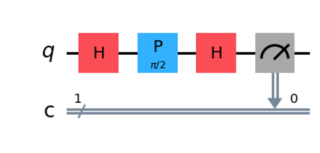
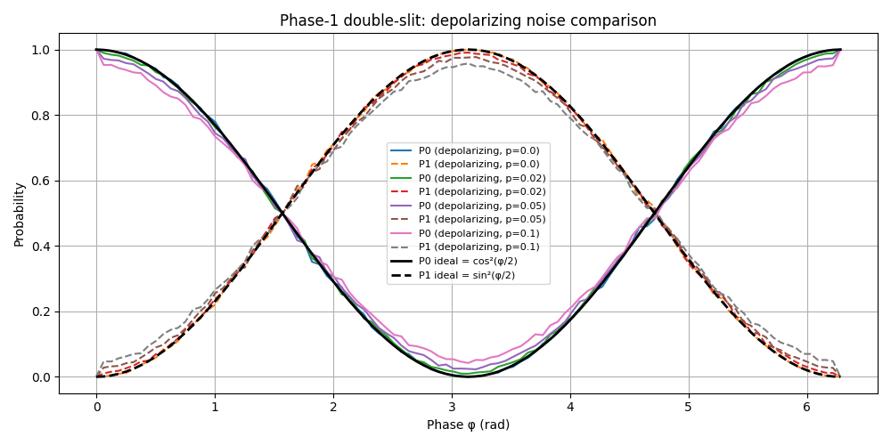
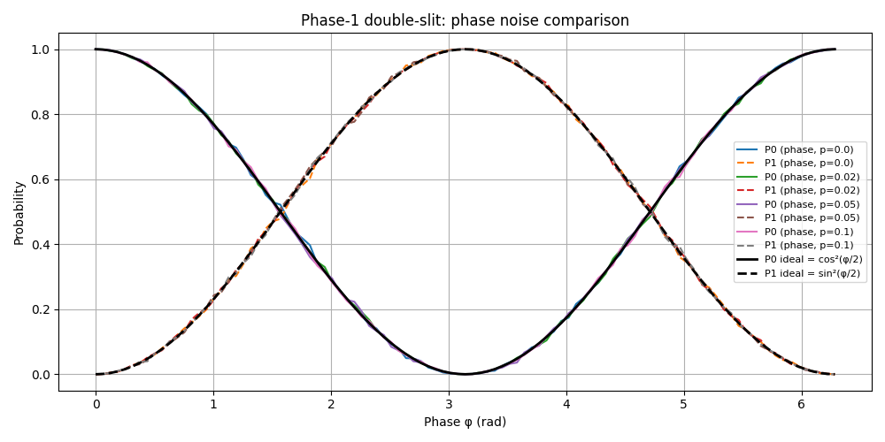
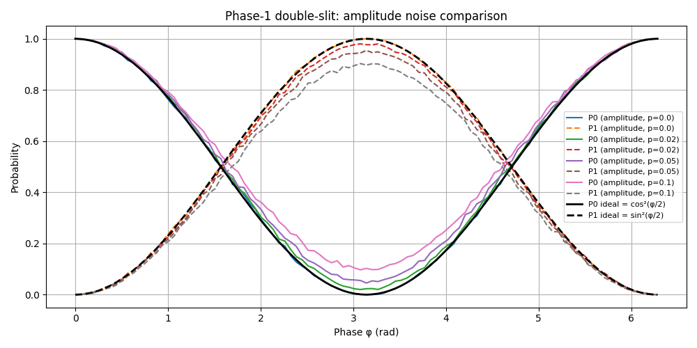

# Goal
The circuit for Single-Qubit Interference consists of:
* A Hadamard gate to create a superposition (analogous to splitting through two slits).
* A phase shift gate to mimic relative path difference between the slits.
* A second Hadamard gate to recombine the paths and produce interference at the measurement stage.

By sweeping the phase shift, we obtain sinusoidal probability fringes for measurement outcomes |0> and |1>.
We then study the effect of different noise channels — depolarizing, phase damping, and amplitude damping — and observe their impact on interference visibility, i.e., the contrast between maximum and minimum fringe intensities.
ates internal degrees of freedom or environmental entanglement, which can lead to decoherence and loss of interference visibility.

# Results
## *depolarizing*
depolarizing_error(p) function is to introduce random bit & phase noise into system

## *phase damping*
phase_damping_error(p) function introduces loss of phase coherence (dephasing)

## *amplitude damping*
amplitude_damping_error(p) is energy loss(p) function

In the single-qubit double-slit circuit, phase damping does almost nothing visible because the phase is re-encoded into a population (measurement basis) at the end.

This means - You only apply one P(φ) rotation (a unitary phase shift), then immediately a Hadamard and measurement.
That means your superposition only “lives” for a very short circuit depth before being turned into populations.
Since the Aer noise model applies phase_damping_error after each gate, but the state isn’t held for many idle steps, the effective dephasing time is tiny → negligible change in interference.
In other words: There isn’t enough “time” (in the sense of circuit depth or idle duration) for phase damping to accumulate and visibly wash out interference fringes.
