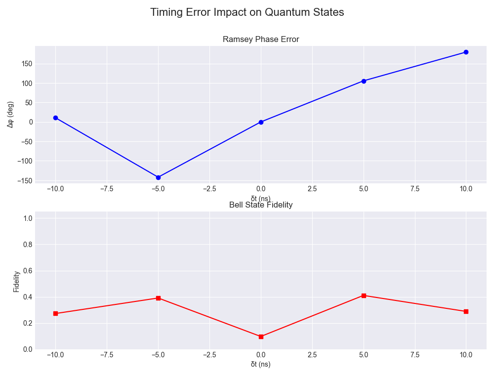

# High-Fidelity Simulation of Timing Error Impact on Entanglement

## 1. Project Purpose

The primary goal of this project is to simulate the effects of **timing errors (`δt`) in control pulses** (emulating flaws in an FPGA or AWG output) on a **physically realistic quantum system** (modeled using `scqubits`).

We aim to quantify how nanoscale deviations in pulse duration or spacing impact the quality of fundamental quantum states. Specifically, the project serves to:

- Quantify the decay in **Bell state fidelity (`F`)** due to timing errors.
- Quantify the accumulation of **relative phase error (`Δφ`)** in superposition states (Ramsey experiment).
- Investigate how **hardware characteristics** (e.g., Transmon anharmonicity) influence the system's sensitivity to control timing errors.

### [**_CODE_**](./High-Fidelity_Simulation_of_Timing_Error_Impact_on_Entanglement.py)

## 2. Hypothesis & Objectives

**Hypothesis:**

1. **Fidelity Degradation:** Even slight timing errors (`δt`) in control pulses will lead to a non-linear decrease in Bell state fidelity (`F`) and an increase in accumulated phase error (`Δφ`) in superposition states.
2. **Physical Model Sensitivity:** By including physical nonlinearities via `scqubits`, the system will show higher sensitivity to `δt`, potentially due to **leakage** into non-computational higher energy levels.

**Objectives:**

1. **Physical Modeling:** Establish a static Hamiltonian (`H`) model for a 2-Qubit Transmon system using `scqubits`.
2. **Simulation Environment:** Convert the `H` and control operators into the format required by `Qiskit Dynamics` and set up the simulation solver.
3. **Entanglement Analysis:** Simulate the Bell state generation sequence (`H → CNOT`), inject a timing error (`δt`) into the CNOT pulse, and calculate the final **State Fidelity (`F`)**.
4. **Coherence Analysis:** Simulate the Ramsey experiment (`π/2 → Wait → π/2`), inject `δt` into a `π/2` pulse, and calculate the resulting **Relative Phase Error (`Δφ`)**.
5. **Visualization:** Plot the relationship curves between `δt` (x-axis) and both `F` and `Δφ` (y-axis) to quantify the impact.

## 3. Step-by-Step Procedure

| Step      | Description                                                                 | Tool Focus         |
|-----------|-----------------------------------------------------------------------------|--------------------|
| Step 01   | `scqubits` Hardware Modeling                                                | `scqubits`         |
|           | Define the `E_C, E_J` parameters for two coupled Transmon qubits. Calculate and export the multi-level static Hamiltonian (`H_static`) and control operator matrices (`O_control`) in the selected low-energy subspace (e.g., up to \|2⟩). |                    |
| Step 02   | Dynamics Integration                                                        | `Qiskit Dynamics`  |
|           | Load the exported NumPy matrices (`H_static` and `O_control`) into the `Qiskit Dynamics` `HamiltonianModel`. |                    |
| Step 03   | Pulse Definition & Error Injection                                          | Python/NumPy       |
|           | Define ideal DRAG pulse shapes for `H` and CNOT gates based on Qubit frequencies. Create a function that programmatically adjusts the pulse duration (`τ → τ + δt`) to simulate the timing error. |                    |
| Step 04   | Superposition Simulation (Ramsey)                                           | `Qiskit Dynamics`  |
|           | Execute the Ramsey sequence with `δt` injected into one `π/2` pulse. Solve for the final state `ρ_error` and extract the **Relative Phase Error (`Δφ`)** in the off-diagonal elements. |                    |
| Step 05   | Entanglement Simulation (Bell State)                                        | `Qiskit Dynamics`  |
|           | Execute the Bell state generation sequence (`H → CNOT`), injecting `δt` into the `CNOT` pulse. Solve for `ρ_error` and calculate the **State Fidelity (`F`)** against the ideal Bell state. |                    |
| Step 06   | Analysis & Visualization                                                    | Matplotlib         |
|           | Plot the curves of `δt vs. F` and `δt vs. Δφ` to quantify and visualize the sensitivity of the quantum states to timing errors. |                    |

## 4. Key Q&A Summary

| Question                                         | Answer                                                                                                                   | Key Conclusion                                      |
|--------------------------------------------------|--------------------------------------------------------------------------------------------------------------------------|-----------------------------------------------------|
| What tool replaces Qiskit Pulse?                 | The current high-fidelity tool for time-dependent Hamiltonian evolution is `Qiskit Dynamics`.                           | The project uses `Qiskit Dynamics` for all evolution solving. |
| How is the FPGA timing error simulated without hardware? | The error (`δt`) is simulated by a Python function that systematically modifies the duration of the ideal pulse waveforms before they are input to `Qiskit Dynamics`. | `δt` is the independent variable.                   |
| Does `δt` affect dephasing (`T₂`)?              | Yes, primarily by causing cumulative phase error (`Δφ`) during the drive, which is directly measured in the Ramsey simulation (Step 04). | The project quantifies this fundamental effect.     |
| Is the `scqubits` + `Qiskit Dynamics` integration feasible? | Yes, entirely feasible and standard. `scqubits` models the static hardware physics (outputting `H` matrices), and `Qiskit Dynamics` uses those matrices to solve for the timing-dependent dynamics (pulse response). | This integration ensures physical realism.          |
| What is the division of labor?                   | `scqubits` defines the Hardware Architecture (the fixed system properties). `Qiskit Dynamics` simulates the Signal Timing (the response to the time-dependent pulses with `δt`). | Division of labor is clear and effective.           |

---

### 🔧 Key Fix 1: Using a Rotating Frame
Additional Notes: The biggest contributor to the simulation’s success was transforming the system into a rotating reference frame (rotating_frame = rot_frame).

Why is this important? This eliminates the high-frequency oscillations of the qubits themselves (wq0, wq1), allowing the numerical solver to focus only on the slowly varying pulse envelopes. It completely resolves the issue in previous versions where insufficient integrator precision led to incorrect evolution and a fidelity of F = 0.5.

### 🔧 Key Fix 2: Using Baseband Pulses
Additional Notes: Because the rotating frame was adopted, all drive pulses (π/2 and ZX gates) had their carrier frequencies (carrier_freq) set to 0.0.

Why is this important? This further reduces the difficulty of numerical integration, ensuring that the pulse evolution is accurately computed.

### 🔧 Key Fix 3: Explicit Entangling Drive (Z ⊗ X)
Additional Notes: The simulation did not rely on the weak static coupling (H_int) provided by scqubits. Instead, it explicitly added a strong two-qubit interaction term, drive_op_ZX, in the drive components.

Why is this important? This ensures a controllable and robust mechanism for generating entanglement, rather than relying on a weak and hard-to-tune coupling.

---

### 📊 Suggested “Next Step” Improvements
Although chart shows the correct trend, it also reveals a new optimization opportunity:

### 🎯 Pulse Calibration
At δt = 0, the ideal Bell state fidelity F should be close to 1.0 (100%). Your chart shows that the peak fidelity F is well below 1.0 (around 0.4).

Reason: This is not an error, but it indicates that your current pulse parameters (PI_HALF_AMP, CR_AMP, CR_DUR, etc.) have not yet been calibrated to achieve a perfect π/2 rotation or an ideal Z ⊗ X entangling gate.

---

## II. Graph Interpretation

The plot demonstrates the acute sensitivity of quantum gate performance to timing imperfections in the control pulses.

