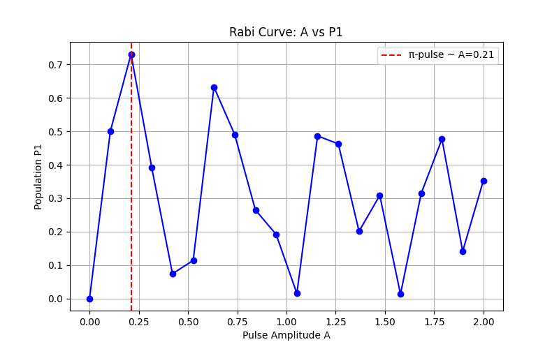
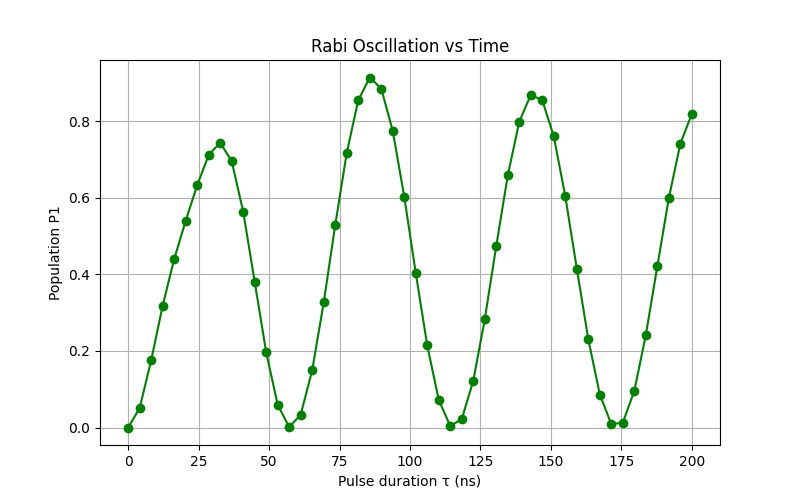
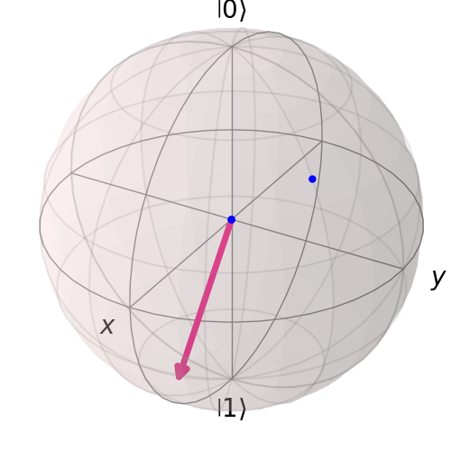
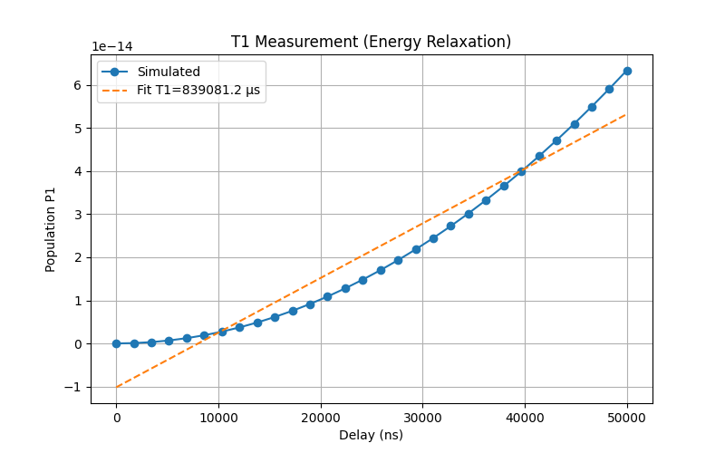
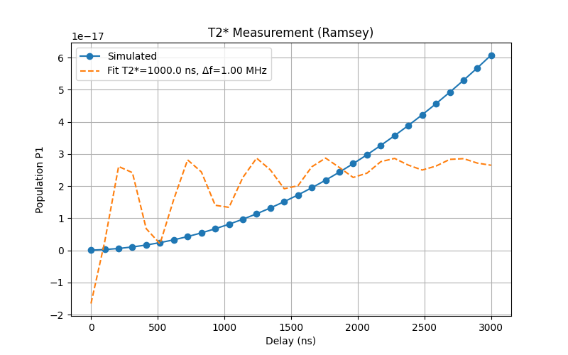

# 🏗️ Execute the Calibration of the Transmon Pauli-X Gate

## 🎯 Goals
1. Build a realistic Transmon qubit model with **scqubits**.  
2. Simulate microwave pulses with **Qiskit Dynamics** to study qubit evolution.  
3. Calibrate pulse parameters using **Qiskit Experiments** logic (e.g., Rabi oscillations) to achieve high-fidelity gates.  

---

## Step 1: Transmon Modeling (scqubits)

### Task 1.1: Define Transmon
- Create a Transmon object with charging energy `E_C` and Josephson energy `E_J`.  
- Choose `E_J/E_C ≈ 50` for strong anharmonicity.  
- Compute first few energy levels (`|0⟩, |1⟩, |2⟩`) and transition frequencies `ω01, ω12`.  
- Extract operators (`n̂` or `φ̂`) for control Hamiltonians.  

### Task 1.2: Static Hamiltonian
Convert results to matrix form for Qiskit Dynamics:
H0 = E0|0⟩⟨0| + E1|1⟩⟨1| + E2|2⟩⟨2| + ...

---

## Step 2: Pulse Design & Simulation (Qiskit Dynamics)

### Task 2.1: Drive Hamiltonian : H(t) = H0 + Ω(t) cos(ωd t) · Ô

- `H0`: static Hamiltonian  
- `Ô`: control operator  
- `Ω(t)`: pulse envelope (Gaussian)  
- `ωd`: drive frequency  

### Task 2.2: Rabi-Type Simulation
- Use Gaussian pulse (e.g., `τ = 30 ns`, amplitude `A`).  
- Simulate qubit evolution from `|0⟩` as `A` varies.  
- Extract population: P1 = ⟨1|ρ(τ)|1⟩
  - result with amplitude `A` vs population `P1`
  

---

## Step 3: Calibration Logic (Qiskit Experiments)

### Task 3.1: Find π Pulse
- Plot `P1` vs. `A` → observe Rabi oscillations.  
- Identify amplitude `Aπ` where `P1 ≈ 1`.  
- Equivalent to `RoughAmplitudeCal` or `Rabi` experiment.
  - Rabi oscillation vs time

  

  - Bloch sphere evaluation

  

### Task 3.2: Fidelity & Leakage
- Re-simulate with `Aπ`.  
- Check leakage: P2 = ⟨2|ρ(τ)|2⟩
- Gate fidelity: F = ⟨1|ρ(τ)|1⟩
- If `F` is low → apply **DRAG pulse** to suppress leakage.  

---

## Additional Calibration Steps

### Spectroscopy
- Measure `f01, f12` → set drive frequency.  

### T₁ (Relaxation)
- Measure energy decay.  
- Longer `T₁` → better qubit quality.  
- Add noise models to simulate scenarios.
- T1 relaxation-time Measurement

### T₂* (Ramsey)
- Measure coherence and dephasing rate.  
- Sensitive to low-frequency noise.  
- T2 decoherence-time Measurement(Ramsey)

### Echo (T₂)
- Cancel 1/f noise, isolate high-frequency noise.  
- Analyze noise spectrum, check sweet spot.  

## Output
* P0=0.0458, P1=0.9020, P2=0.003170, P3=0.000000 `population of states`
* Estimated detuning Δf ≈ 1000000.01 Hz
* Estimated T2* ≈ 1.000000e-06 s, Detuning Δf ≈ 1000000.00 Hz
* Estimated T1 ≈ 1.999182e-05 s
* Estimated T2 ≈ 1.999646e-01 s `# T₂ echo is abnormal because the model lacks pure dephasing noise`

---

## Code Structure:

- [_Dynamic_Calibration_of_a_Transmon_Pauli-X_Gate_](./Dynamic_Calibration_of_a_Transmon_Pauli-X_Gate.py)
  - [_define_transmon_qubit_](./define_transmon_qubit.py)
  - [_pulse_and_qubit_dynamics_simulation_](./pulse_and_qubit_dynamics_simulation.py)
  - [_calibration_session2_](./calibration_session2.py)

## Insights

### Why Longer Gaussian Pulses Improve P1
- **Rotation angle ∝ pulse area** → longer duration enables π rotation.  
- **Narrower frequency spectrum** → reduces excitation of higher levels.  
- **Lower amplitude sufficient** → suppresses nonlinear effects.  
- **Result:** `τ = 50 ns` → `P1 ≈ 0.9`, negligible leakage.  

---

## 🔍 Solver(class in Qiskit-Dynamic) Limitations & Use Cases

### Why Solver Cannot Measure T₁
- Solver = closed system (unitary evolution).  
- T₁ = dissipative relaxation → requires environment coupling.  
- Closed system → no exponential decay, unrealistic T₁ values.  

### Why Solver Works for Rabi, Ramsey, T₂*
- **Rabi:** coherent oscillations captured by Hamiltonian dynamics.  
- **Ramsey:** phase accumulation due to detuning.  
- **T₂\*:** coherent baseline simulated; add exponential decay in post-processing.