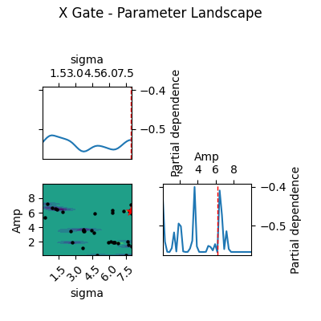
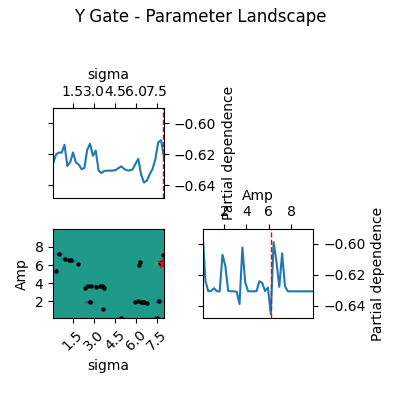
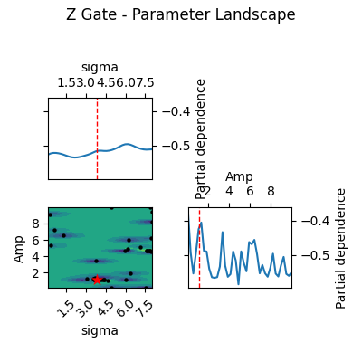

# Machine-Learning-Driven Spin Qubit Pulse Calibration with QuTiP

## 🎯 Project Purpose

The goal of this project is to implement **Gaussian Process Bayesian Optimization (GP-BO)** to automatically optimize the pulse width (sigma) of quantum gates.

- **Objective:** Improve the fidelity of X, Y, and Z gates (phase/detuning gates).
- **Method:**
  - Use **QuTiP** to build the quantum system dynamics model (Hamiltonian).
  - Apply **Gaussian Process (sklearn)** for Bayesian optimization.
- **Optimization Feature:** Automatically select the next most promising sigma value to test, finding the optimal gate pulse with minimal experiments (or simulations).
- **Application Scenario:** A common ML auto-calibration pipeline for spin qubits, superconducting qubits, or ion trap systems.

---

## Code is [_here_](./Machine-Learning-Driven_Spin-Qubit_Pulse_Calibration_with_QuTiP.py)

---

## 📘 Step-by-step Guide

The workflow covers the full process from theory to code structure, execution, visualization, and experimental interpretation.

1. **Build Qubit Hamiltonian**  
   - Each gate has a different driving axis:  
     - X gate (H proportional to sigma_x)  
     - Y gate (H proportional to sigma_y)  
     - Z gate (detuning, H proportional to sigma_z)  

2. **Define Gaussian Pulse**  
   - Gates are formed by Gaussian-shaped pulses:  
     `A * exp[-(t - t0)^2 / (2 * sigma^2)]`  
     where sigma is the pulse width and the calibration target.

3. **Simulate Quantum Gate (`simulate_gate`)**  
   - Build Hamiltonian with detuning term:  
     `H = 0.5 * omega_q * sigma_z + A(t) * H_axis`  
   - Use QuTiP’s `sesolve` to compute time evolution.  
   - Calculate gate fidelity, with different target states for X, Y, and Z gates.

4. **Gaussian Process Bayesian Optimization**  
   - Use `sklearn`’s `GaussianProcessRegressor`.  
   - Optimization combines random sigma (exploration) and acquisition function selection (exploration + exploitation).

5. **Output Three Plots**  
   - **Posterior:** Shows GP-learned fidelity curve.  
   - **Acquisition:** Shows ML decision logic for choosing the next sigma.  
   - **Best Sigma:** Shows the final optimization result.

6. **Repeat Three Times**  
   - Sequentially calibrate X, Y, and Z gates.

---

## Results

- X-Gate Output Three Plots

- Y-Gate Output Three Plots

- Z-Gate Output Three Plots

---

## ❓ Q&A – Questions

| **Question** | **Meaning** |
|--------------|-------------|
| **Q1: Why use Gaussian Process (GP)?** | Because each quantum experiment or simulation is costly, GP can find the optimal pulse width with the fewest measurements. GP also provides uncertainty estimation and balances exploration with exploitation. |
| **Q2: Difference between using ML to find the optimal solution vs brute-force search?** | ML (GP-BO) builds a surrogate model (such as a Gaussian Process) to intelligently select the next test point. The goal is to find the optimal solution with the fewest experiments. Brute-force search, on the other hand, tests all points regardless of cost, which is inefficient. |
| **Q3: Why can X / Y / Z gates use the same workflow?** | Because the pulse shape (Gaussian) remains unchanged; only the Hamiltonian (σx / σy / σz) and the target state need to be modified. |
| **Q4: What do the three output plots represent?** | *Posterior*: the GP-learned fidelity curve model; *Acquisition*: the decision logic GP uses to select the next σ; *Best Sigma*: the final optimal pulse width. |
| **Q5: Does the Z gate also require Gaussian pulses?** | Yes. In spin or superconducting qubit systems, the Z gate can be controlled via detuning (σz), and detuning pulses can also adopt a Gaussian shape. |
| **Q6: Why is sklearn (GP module) needed?** | Because QuTiP only handles quantum dynamics and does not include Bayesian optimization modules, while sklearn’s `GaussianProcessRegressor` is a standard optimization tool. |

---