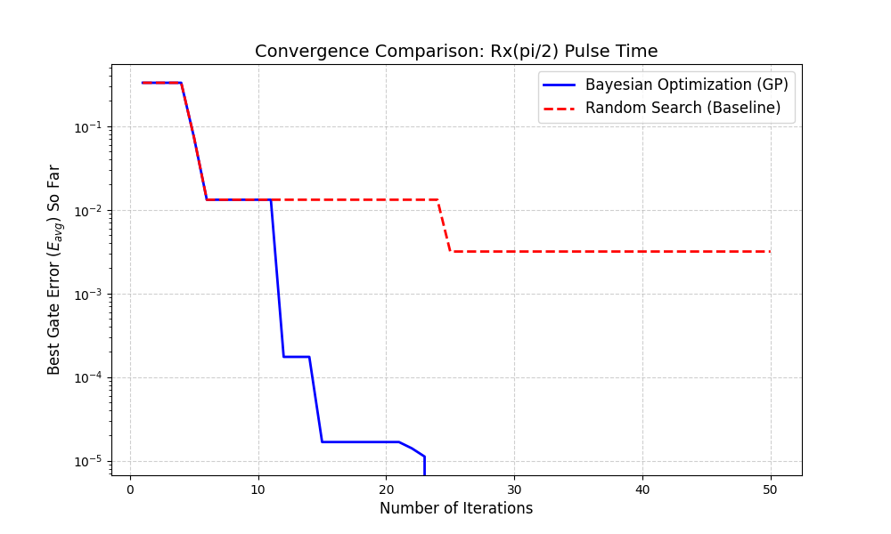
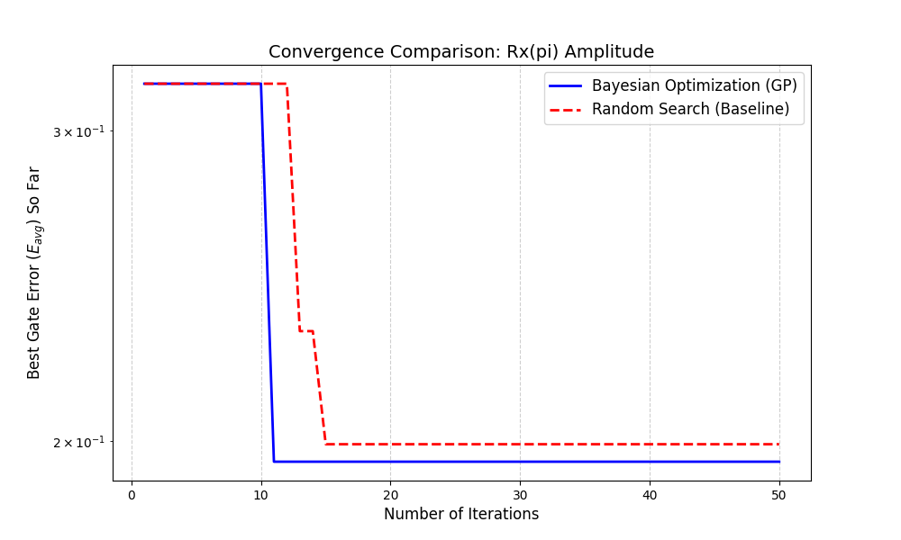
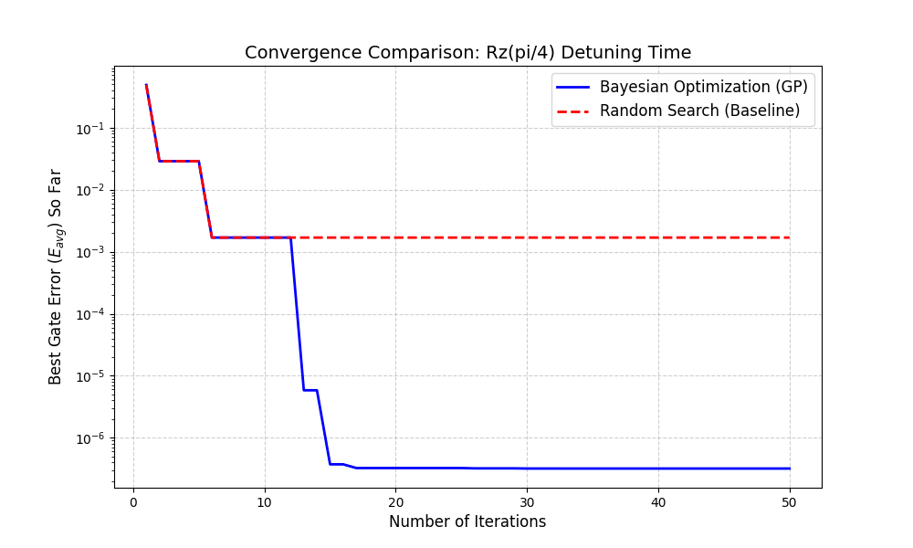

# 🔥 Project Title: Bayesian Optimization for Quantum Gate Calibration

## 🎯 Project Purpose

This proof-of-concept (PoC) project aims to implement an **automated, high-efficiency** quantum gate calibration pipeline. By leveraging **Gaussian Process Bayesian Optimization (GP-BO)**, the goal is to minimize the **average gate error rate ($E_{avg}$)** of a universal single-qubit gate set with the **fewest possible simulations or experiments**.

  * **System:** A two-level quantum system (Qubit) simulated using QuTiP. This framework is applicable to both superconducting and spin qubits.  
  * **Target gates and parameters:**  
    1. **$R_x(\pi/2)$ gate**: Optimize **pulse duration** ($t_{\pi/2}$).  
    2. **$R_x(\pi)$ gate**: Optimize **pulse amplitude** ($\Omega_{\pi}$).  
    3. **$R_z(\theta)$ gate**: Optimize **frequency detuning time** ($t_{detune}$).  
  * **Core value:** Demonstrate the efficiency of Bayesian Optimization in multi-parameter, **black-box** optimization problems, showing that the best quantum control parameters can be found with **minimal computational resources**, suitable for standard desktop computers.

-----

## Code is [_here_](./Bayesian_Optimization_for_Quantum_Gate_Calibration.py)

-----

## 📘 Step-by-step Guide

The workflow consists of three independent optimization tasks, each minimizing $E_{avg} = 1 - F_{avg}$ (average gate fidelity).

### 1. System Construction and Error Function Definition

| Gate Type | Optimization Parameter | Target Gate ($U_{target}$) | Hamiltonian ($H$) |
| :--- | :--- | :--- | :--- |
| **$R_x(\pi/2)$** | Pulse duration $t_{\pi/2}$ | $e^{-i (\pi/4) \sigma_x}$ | $H = \frac{\Omega_{fixed}}{2} \sigma_x$ (time-invariant) |
| **$R_x(\pi)$** | Pulse amplitude $\Omega_{\pi}$ | $e^{-i (\pi/2) \sigma_x}$ | $H = \frac{\Omega_{\pi}}{2} \sigma_x$ (time-invariant) |
| **$R_z(\theta)$** | Detuning time $t_{detune}$ | $e^{-i (\pi/8) \sigma_z}$ (example: $R_z(\pi/4)$) | $H = \frac{\Delta_{fixed}}{2} \sigma_z$ (time-invariant) |

### 2. Implement Black-box Optimization Function (`gate_error`)

  * **Core functionality:** For each parameter, create a Python function `error_func(parameter)`. This function takes a single control parameter, uses **QuTiP’s `propagator` function** to simulate **time-invariant** quantum evolution, and computes the **average gate error rate ($E_{avg}$)** between $U_{sim}$ and $U_{target}$ as the optimization objective.

### 3. Bayesian Optimization and Benchmarking (skopt)

  * **Define search space:** Use `skopt.space.Real` to set reasonable continuous bounds for the three independent parameters ($t_{pulse}, \Omega_{\pi}, t_{detune}$).  
  * **Run BO:** Use `skopt.gp_minimize` with a **Gaussian Process** surrogate model and the **Expected Improvement (EI)** acquisition function to select the next evaluation point.  
  * **Run benchmark:** Perform **Random Search** with the same number of iterations as a baseline for performance comparison.  

### 4. Data Analysis and Visualization

  * **Convergence plots:** Plot iteration count vs. historical best gate error rate for the three gates, comparing BO and Random Search convergence speed.  
  * **Posterior landscape plots:** Visualize the **error function landscape** learned by the Gaussian Process at the end of optimization, showing predicted mean and uncertainty across parameter space.  
  * **Results report:** Report the optimal control parameters ($t_{opt}$ or $\Omega_{opt}$) and the minimum achieved error rate $E_{avg, min}$ for each gate.  

-----

## Results

| Status | Plot |
| :--- | :--- |
| Rxpi_2_Pulse_Time_Convergence |  |
| Rxpi_Amplitude_Convergence |  |
| Rzpi_4_Detuning_Time_Convergence |  |

-----

## ❓ Q&A – Questions

| **Question** | **Meaning and Explanation** |
| :--- | :--- |
| **Q1: Why use Bayesian Optimization (BO)?** | Each quantum simulation or experiment is costly. BO builds a **surrogate model** (Gaussian Process) to intelligently select the next evaluation point, finding optimal parameters with fewer iterations, far more efficient than grid or random search. |
| **Q2: What is the source of error in this project?** | Errors are purely **systematic errors**, caused by imprecise control parameters leading to mismatch between $U_{sim}$ and $U_{target}$. **No environmental noise** is included. |
| **Q3: Why calibrate $R_x(\pi/2)$ duration and $R_x(\pi)$ amplitude?** | These represent the two most common calibration scenarios in labs: **fixed power, optimize time**, and **fixed time, optimize power**, ensuring general applicability. |
| **Q4: What physical qubit systems does this project address?** | The project uses an **abstract Hamiltonian model**, applicable to **superconducting qubits** and **spin qubits**, both relying on precise control of pulse duration, amplitude, and frequency detuning. |
| **Q5: What are the key code optimization points?** | **Ensuring fair comparison between BO and Random Search.** Optimizations include: 1. Implementing full **Random Search** (`base_estimator='dummy'`) as baseline. 2. Fixing `skopt.plots.plot_convergence` `TypeError` bug. 3. **Manual Matplotlib plotting** to clearly distinguish BO (blue solid line) and RS (red dashed line) in legends. |
| **Q6: What advantage does BO show in convergence plots?** | BO’s convergence curve (blue line) drops **faster and more consistently** to very low error rates compared to Random Search (red line), proving BO’s efficiency in finding near-optimal parameters early on. |
| **Q7: Why does Random Search (RS) convergence curve flatten?** | This is normal, showing RS’s **plateau phase**: 1. **Plot nature:** Curve tracks “best error rate observed so far.” A flat line means subsequent random trials failed to beat the current best. 2. **Probability issue:** Low-error regions are very small. Once a good result is found, the chance of randomly hitting an even better one becomes extremely low. |

-----

## 🆚 Project Comparison: New Project vs. Original Project (README.md)

Below is a detailed comparison between this project and your original “**Machine Learning-driven Spin Qubit Pulse Calibration**” project:

| Feature | Original Project (README.md) | **New Project (Bayesian Optimization for High-Fidelity...)** |
| :--- | :--- | :--- |
| **Core optimization goal** | Optimize a **single** pulse shape parameter: **Gaussian pulse width ($\sigma$)**. | Optimize **three independent** physical control parameters: **pulse duration ($t$), amplitude ($\Omega$), detuning time ($t_{detune}$)**. |
| **Pulse physical model** | **Gaussian pulse:** involves **time-dependent Hamiltonian $H(t)$**. | **Square pulse:** uses **time-invariant Hamiltonian $H$**. |
| **QuTiP solver** | Requires `sesolve` to handle **time-dependent** problems. | Uses only `propagator` for **time-invariant** evolution. |
| **Computational complexity** | **Higher**, requires time-domain integration, unsuitable for standard desktops. | **Very low**, fast computation, ideal for **lightweight PoC**. |
| **Project focus** | Focused on **pulse shaping**, mitigating detailed noise and leakage. | Focused on **fast calibration** of basic control variables, demonstrating BO’s optimization efficiency. |