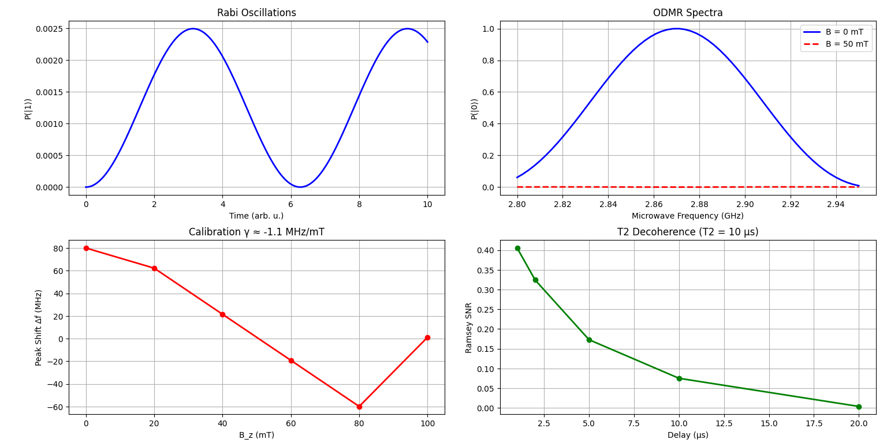
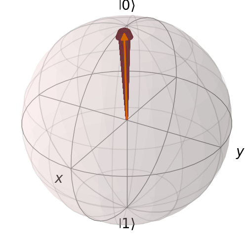

# 🧪 Quantum Diamond Magnetometry Simulation Based on QuTiP & Qiskit

This project builds a small digital twin of an NV‑center–based quantum magnetometer using **QuTiP** for spin dynamics and **Qiskit** for noisy readout simulation.

---

## 1. Problem Statement

Conventional magnetic sensors (for example Hall sensors) are limited in sensitivity and spatial resolution at the nanoscale.  
NV (Nitrogen‑Vacancy) centers in diamond are quantum sensors whose spin energy levels respond very sensitively to external magnetic fields, enabling nanoscale magnetometry at room temperature.

Core questions:

- Can we reproduce NV spin Zeeman splitting and ODMR signals using software only, without any hardware?  
- Can we build a calibration curve that links magnetic‑field strength to the shift of the resonance frequency?

---

## 2. Hypothesis and Objectives

**Hypothesis**

- When the external magnetic field \(B_z\) increases, the NV spin levels experience an approximately linear Zeeman splitting.  
- This splitting can be accurately measured via ODMR (Optically Detected Magnetic Resonance), by scanning the microwave frequency.

**Objectives**

- Use **QuTiP** to build a two‑level NV model and simulate:
  - Rabi oscillations and spin trajectories on the Bloch sphere  
  - ODMR spectra and resonance shifts under different magnetic fields
- Use **Qiskit** to build a Ramsey circuit with **T1 / T2 noise**, and study how decoherence reduces the signal‑to‑noise ratio (SNR).  
- Visualize:
  - Rabi curves, ODMR curves, and the calibration line “frequency shift vs magnetic field”  
  - Ramsey SNR decay and Bloch‑sphere spin trajectories

---

## 3. Tools and Environment

- **Language**: Python 3.8 or newer  
- **Core packages**:
  - `qutip` – solve Schrödinger or master equations; generate time evolution and Bloch‑sphere data
  - `qiskit`, `qiskit-aer` – build quantum circuits with T1/T2 noise models
  - `numpy`, `matplotlib` – numerical computation and plotting
- **Environment**: Jupyter Notebook, Google Colab, or VS Code with Python

---

## 4. Methodology

### 4.1 System Modeling (QuTiP)

- The NV center is modeled as an effective two‑level system with basis states |0> and |1>.  
- In QuTiP we define effective Hamiltonians:

  - **Rabi model**:  
    H = (omega0 / 2) * sigma_z + (Omega / 2) * sigma_x  
    where omega0 is the level splitting and Omega is the drive strength.

  - **ODMR effective model (in the rotating frame)**:  
    Heff = (Delta / 2) * sigma_z + (Omega / 2) * sigma_x  
    where Delta = f − fres(Bz), f is the scanned microwave frequency and fres(Bz) is the resonance frequency at field Bz.

### 4.2 Rabi Oscillations

- Use `qutip.sesolve` to simulate the time evolution of the excited‑state probability P(|1>) under a resonant microwave drive.  
- The Rabi plot shows P(|1>) oscillating in time, which means the spin is coherently flipping between |0> and |1>. The oscillation period is set by the Rabi frequency.  
- The small amplitude in the chosen parameter regime reflects the particular scaling of the effective Hamiltonian, but the oscillatory pattern and frequency clearly demonstrate coherent quantum control.

### 4.3 ODMR Spectrum

- Scan the microwave frequency f. For each f, compute the evolved ground‑state probability P(|0>).  
- When Bz = 0 mT, the curve shows a resonance feature near the NV zero‑field splitting (~2.87 GHz). Adding a finite magnetic field Bz shifts the resonance frequency.  
- This reproduces the essence of experimental ODMR, where fluorescence vs microwave frequency exhibits dips or peaks whose positions reflect the energy level spacing.

### 4.4 Magnetic Field Sensing

- For several magnetic‑field values Bz (for example from 0 to 0.1 T), repeat the ODMR scan and extract the resonance frequency fres(Bz).  
- Define the frequency shift Delta f = fres(Bz) − fres(0).  
- Plot Delta f vs Bz to obtain a calibration line. In the simulation Delta f is approximately proportional to Bz, with a slope on the order of MHz per mT.  
- This shows that once the resonance shift is measured, the external magnetic field can be inferred. The exact sign and numerical value of the slope depend on model simplifications and scan range, but the linear trend matches the Zeeman effect.

### 4.5 Noise and Decoherence (Qiskit)

- In Qiskit, build a single‑qubit Ramsey circuit:

  1. Apply an Rx(pi/2) pulse to prepare a superposition from |0>.  
  2. Let the qubit freely evolve for a delay time tau (implemented with a delay gate).  
  3. Apply a second Rx(pi/2) pulse.  
  4. Measure in the Z basis and collect statistics.

- Use `thermal_relaxation_error` to attach T1/T2 noise to the Rx and delay operations.  
- Scan several delay times tau (for example 1, 2, 5, 10, 20 microseconds). For each tau, compute a contrast or SNR metric, such as |P0 − 0.5|, where P0 is the probability of outcome “0”.  
- The resulting curve shows that SNR decreases as tau gets longer, representing the loss of phase coherence and the reduction of Ramsey fringe contrast.

### 4.6 Visualization

- Use matplotlib to generate four main subplots:
  - Rabi oscillations: P(|1>) as a function of time  
  - ODMR spectra: P(|0>) vs frequency at different magnetic fields  
  - Calibration curve: Delta f vs Bz  
  - Ramsey SNR vs delay time
- Use `qutip.Bloch` to draw the Bloch sphere and add the sequence of simulated states as a trajectory.  
  In the current parameter regime, the trajectory stays close to the north pole, indicating that the spin remains mostly in the ground state |0> with small deviations caused by the drive.

---

## 5. Results and Interpretation

### [_Code_](./Quantum_Diamond_Magnetometry_Simulation_using_QuTiP_and_Qiskit.py)

### 5.1 Rabi Oscillations

- The Rabi plot shows clear oscillations in P(|1>) over time, confirming that the microwave drive generates coherent rotations of the NV spin.  
- Even though the probability amplitude is small, the existence and frequency of the oscillation agree with the expectations from the Rabi model.

### 5.2 ODMR and Zeeman Effect

- Comparing ODMR spectra at different fields (for example B = 0 mT and B = 50 mT) shows that the resonance position shifts along the frequency axis as the field changes.  
- The Delta f vs Bz calibration plot is approximately linear, consistent with the theoretical relation that frequency shift is proportional to the applied magnetic field (Zeeman effect).  
- This demonstrates that measuring the resonance frequency shift allows one to reconstruct the external magnetic field, which is the core principle of an NV magnetometer.

### 5.3 Decoherence and Sensitivity

- The Ramsey SNR vs delay plot shows a monotonic decay of contrast with increasing tau.  
- This behavior corresponds to phase information being lost over time due to T2 decoherence, leading to reduced visibility of the Ramsey fringes.  
- In practice, this means that although longer interrogation times could improve frequency resolution, T2 limits how long the sensor can integrate before the signal becomes too weak, so there is an optimal operating time.

### 5.4 Bloch Sphere

- The Bloch‑sphere visualization shows the state vector oscillating near the +z axis, consistent with a qubit initially in |0> and driven mainly around the x axis.  
- The Bloch sphere provides a geometric picture of how Rabi and Ramsey sequences correspond to rotations and how noise would gradually shrink the trajectory back toward the z axis.

---

## 6. Summarize in Short

- Use the electron spin of the NV⁻ center in diamond as a “quantum compass”: an external magnetic field causes Zeeman splitting of the spin energy levels and changes the level spacing.  
- By driving the spin with microwave pulses, you can observe Rabi oscillations between |0> and |1>, and use Ramsey experiments together with T1 and T2 measurements to quantify lifetime and coherence time, which determine the sensor’s energy resolution and usable measurement time.  
- Plotting the full spin evolution on the Bloch sphere lets you directly see how the state vector rotates under the magnetic field and microwave drive, and how it slowly “shrinks back” toward the z‑axis in the presence of noise.  
- In summary, this project uses simulation to understand how a diamond NV⁻ center electron spin can be used to detect external magnetic fields, and to explore the operating principles and limitations of such a system (sensitivity, linear calibration, and the T2‑limited maximum interrogation time).