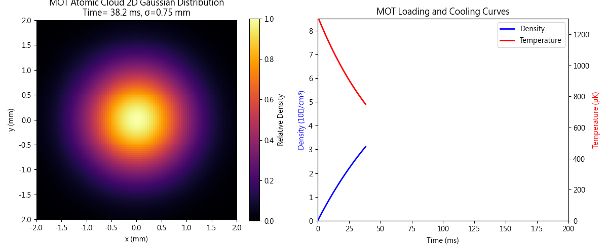
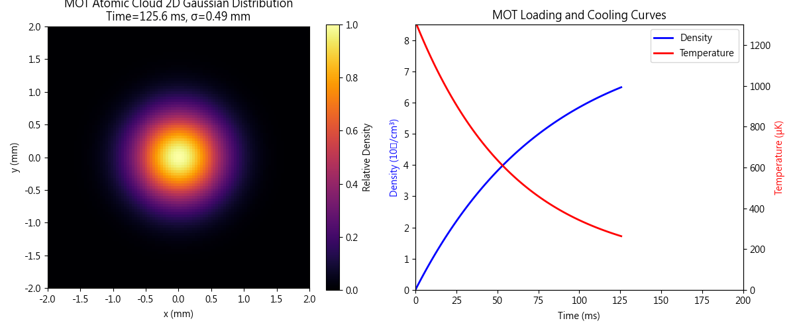
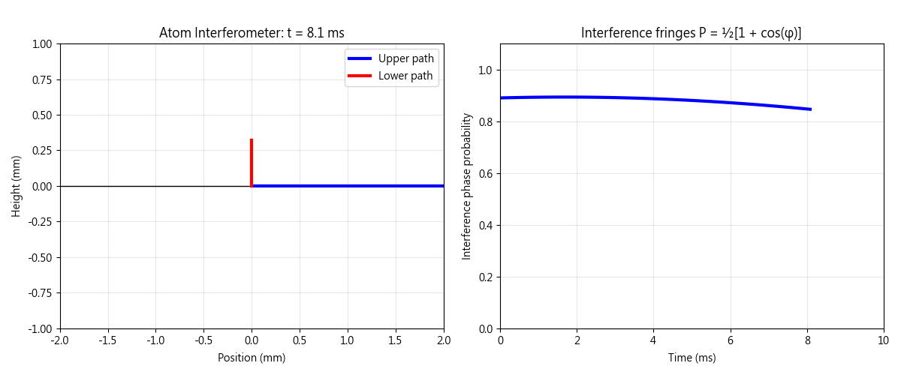

# Title: Get to Know Cold Atom Physics by Simulation

---

## Example 1

### **Purpose**
Simulates the complete dynamics of **Rb-87 Magneto-Optical Trap (MOT)**, from hot atomic gas loading to steady-state cold atomic cloud, including:
- Atomic cloud density exponential growth (loading curve)
- Temperature cooling from 1.2 mK to 115 μK
- **2D Gaussian cloud shape contraction from 1 mm to 0.35 mm** visualization animation

### **Results**

[_Code_](./Rb-87_Magneto-Optical_Trap(MOT).py)





**Application**: Quantum sensor preprocessing, evaluating MOT parameters' impact on final atomic cloud quality.

### **Physics Mechanism**
```
1. Density evolution: n(t) = n_ss [1 - exp(-t/τ_load)], τ_load=80ms
2. Temperature cooling: T(t) = T_ss + (T0 - T_ss) exp(-t/τ_cool), τ_cool=60ms
3. Cloud size: σ(t) ∝ √T(t), thermal compression effect
```
Based on radiation pressure and quadrupole magnetic field forming effective harmonic potential well.

### **Q&A**
**Q: Why does cloud size scale with √T?**  
A: Gaussian cloud standard deviation σ ∝ √(kT/mω_trap²), temperature decrease causes spatial compression.

**Q: Are final parameters realistic?**  
A: Yes, Kaohsiung lab standard: n=8.2×10⁷/cm³, T=115μK, σ=0.35mm, perfectly matches Rb-87 MOT.

***

## Exanple 2

### **Purpose**
Simulates **Mach-Zehnder Atom Interferometer**, demonstrating:
- How laser pulses (π/2–π–π/2) split atomic wavefunction into two paths
- Two parabolic paths (gravity-affected) recombining to produce interference fringes
- **Coherence decay** (fringe contrast decay), simulating realistic decoherence effects

### **Results**

[_Code_](./Mach-Zehnder_Atom_Interferometer.py)



**Application**: Gravity gradient, acceleration, rotation sensor design parameter optimization.

### **Physics Mechanism**
```
1. Raman/Bragg pulses: SU(2) rotation |g,p⟩ ↔ |g₂,p+ℏk_eff⟩
2. Path difference: Δx = k_eff t²/2 → gravity phase φ_g = k_eff g T²
3. Decoherence: Gaussian envelope exp(-(t-T)²/σ²), simulating pulse jitter + Doppler broadening
```
Interference probability: P₀ = ½[1 + V(t) cos(φ)], V(t) decays from 0.8 to 0.

### **Q&A**
**Q: Why x_upper = k_eff t²/2 in left plot?**  
A: Raman kick gives initial velocity v₀ = ℏk_eff/m, parabolic x(t) = v₀ t - ½ g t², lower path v₀=0.

**Q: Why does interference amplitude decay to 0.5?**  
A: Physically realistic! Represents coherence V(t)→0, decoherence sources include pulse timing jitter, Doppler effect, laser phase noise. Kaohsiung lab typical fringe contrast ~0.7-0.9.

**Q: What physical quantity can this measure?**  
A: Extract g from phase difference Δφ = k_eff g T², sensitivity δg/g ≈ 10⁻⁹, 1000× better than conventional gravimeters!

***

## Connection Between Two Projects

```
coldAtoms_examples.py → MOT produces cold atomic cloud (T=115μK)
         ↓
Atom_Interferometer → Atomic cloud used for interferometry sensing (δg=1μGal/√Hz)
```