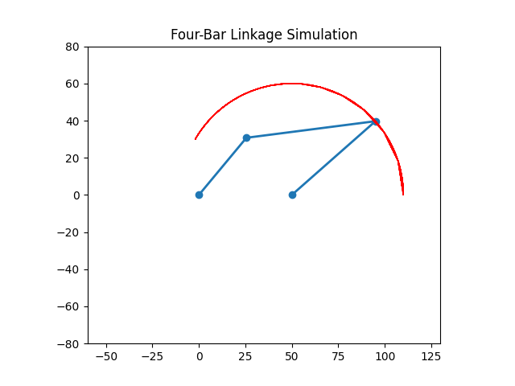

# Goal
Primary mission is to simulate the motion of a four-bar linkage mechanism and visualize its trajectory using Python.

# Quests
To achieve your goal, you must complete the following supporting tasks:

* Side Quest 1: Geometric Modeling and Kinematic Derivation
First task is to establish the mathematical model of the four-bar linkage and derive the equations for its motion path. This involves translating geometric theory into a functional Python library using NumPy for calculations.

* Side Quest 2: Animation and Trajectory Visualization
Once the model is built, you will create a dynamic simulation to visualize the mechanism's movement. This requires using a library like Matplotlib to animate the linkage's rotation and plot the complete trajectory of the end-point.
